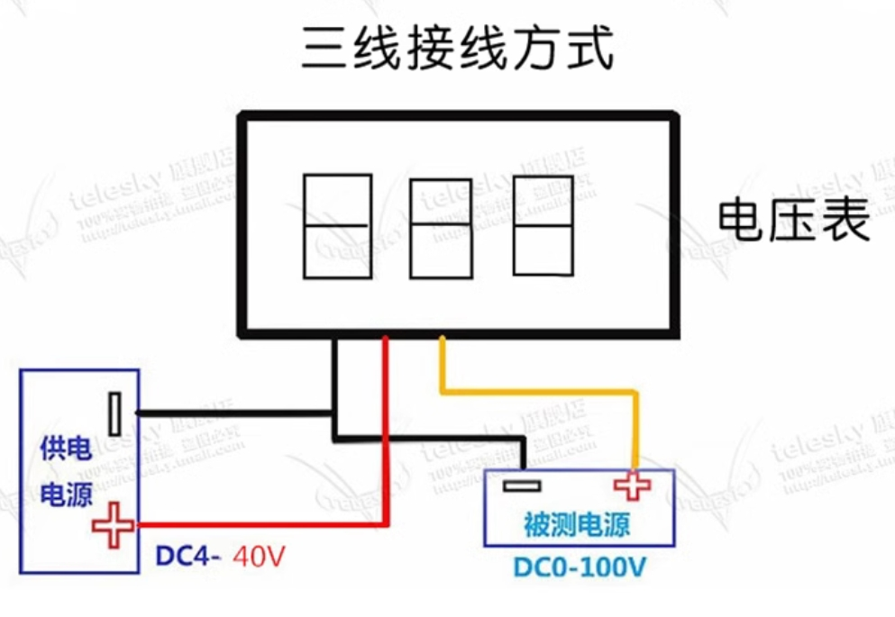

# Dual-Input-Mini-DC-Power-Supply

> **双输入模式的DC升降压电源**

## 设计背景

在平时调试硬件时，经常需要给不同电路供电。有时只调试几个小功率的电路板，或者只需要提供几个模拟直流信号，却要搬出几台大体积大功率的台式直流电源，既不便于调试，也不便于携带和运输。一般的DC-DC变换器模块虽然有小体积的优点，但大多仅为一块裸露的电路板，既过于粗糙又不变接线；此外大多为Buck或Boost拓扑，仅支持降压或升压输出，输出电压调节也不够灵活。每个人的桌面上都有Type-C接口充电器，有的是大功率快充，兼具体积小、功率大的优点，但是Type-C接口无法给一般的电路板供电，而且输出电压固定无法调节。

那么，有没有一种便携式的桌面级电源，可以克服台式直流电源、DC-DC变换器模块以及Type-C接口充电器的所有缺点呢？

## 总体方案

一个小巧便携的桌面升降压DC-DC电源，支持Type-C和接线端子两种方式供电，自带PD/QC诱骗电路，输出电压数显。基于XL6019电源管理芯片和SEPIC拓扑，具有5V到35V宽输入电压范围及1.25V到36V可调输出电压范围，固定180KHz开关频率，最大5A开关电流。可用于桌面测试设备供电、手持式设备供电、及普通电子设备电源适配器。

由输入输出模块、SEPIC升降压模块、输出调节模块、输出电压测量模块、输出滤波模块、工作指示灯模块组成，设计了透明亚克力外壳。PCB长8cm、宽3.5cm。

（1）输入输出模块

输入输出模块由电能输入接口和稳压输出接口组成。电能输入接口包括①3.81mm 2-Pin快速插拔式接线端子和②USB Type-C快充触发器，两种电能输入接口任意任一均可，但不可同时使用；稳压输出接口为③3.81mm 2-Pin快速插拔式接线端子。

（2）SEPIC升降压模块

SEPIC升降压模块由④SEPIC拓扑电路组成，该部分电路以XL6019电源管理芯片为控制核心，实现从输入到输出的非隔离升降压调节。

（3）输出调节模块

输出调节模块由⑤输出调节电路组成，该部分电路基于电位器及电阻分压电路，调节输出电压反馈至电源管理芯片的反馈量，实现1.25V－36V任意电压稳压输出。

（4）输出电压测量模块

输出电压测量模块由⑥三线电压表头组成，实现对输出电压的测量与显示，显示范围达3位有效数字。

（5）输出滤波模块

输出滤波模块由⑦输出滤波电路组成，该部分电路基于无源LC滤波器，实现对稳压输出的低通滤波。

（6）工作指示灯模块

工作指示灯模块由⑧电压输入指示灯及○9电压输出指示灯组成，当电源正常工作时，电压输入指示灯和电压输出指示灯稳定常亮。

## 主要参数

<table>
<tr>
    <td>外观尺寸（长×宽×高）</td>
    <td>8cm×3.5cm×2.1cm</td>
</tr>
<tr>
    <td>接线端子输入电压范围</td>
    <td>5V－35V DC</td>
</tr>
<tr>
    <td>USB Type-C输入电压等级范围</td>
    <td>9V,12V,15V,18V,20V DC</td>
</tr>
<tr>
    <td>稳压输出电压范围</td>
    <td>1.25V－36V DC</td>
</tr>
<tr>
    <td>开关频率</td>
    <td>180KHz</td>
</tr>
<tr>
    <td>最大开关电流</td>
    <td>5A</td>
</tr>
<tr>
    <td>纹波大小</td>
    <td>约30mV</td>
</tr>
</table>

## 附录

（1）3D模型效果图

（2）电路图

（3）电压表头接线方式说明

[电压表头购买链接（仅供参考）：0.36寸电压表头（3线红色）](https://detail.tmall.com/item.htm?id=41255039320)

（4）PD/QC诱骗模块

[电压表头购买链接（仅供参考）：20V蓝色PDQC](https://item.taobao.com/item.htm?id=656302466357)

## 参考设计

> **感谢以下开源项目作者**
>
> [红蘑菇桌面电源MINI版](https://oshwhub.com/xiangyang0926/xl6019-sepic_copy_copy)
> 
> 本项目设计为红蘑菇桌面电源接线端子+亚克力外壳升级版